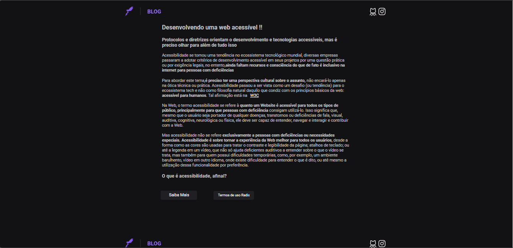

<h1 align="center">
  Accessible Blog
</h1>

<p align="center">
  <a href="#-Technologies"><b>Technologies</b></a>&nbsp;&nbsp;&nbsp;|&nbsp;&nbsp;&nbsp;
  <a href="#-Project"><b>Project</b></a>&nbsp;&nbsp;&nbsp;
</p>

---

<div align="center">
  
</div>

## 🚀 Getting started

Clone the project and access the folder.

```bash
$ git clone https://github.com/diaspd/accessible-blog.git
$ cd 
```

Follow the steps below:
```bash
# Install the dependencies
$ npm i

# Start the project
$ npm run dev
```
The app will be available on `http://localhost:3000`

<br></br>

## 💻 Technologies

This project was developed with the following technologies:
<b>
- React
- Next Js
- Axe (accessibility)
</b>

<br></br>

## 📄 Project
💰 A blog with accessiblities guide by w3c. Using Axe, RadixUI aria labels and more.

<br></br>

Made with ♥ by Pedro Dias. 👋 Follow me on social media! </br>

If you can give a little star, I appreciate it 🤩
